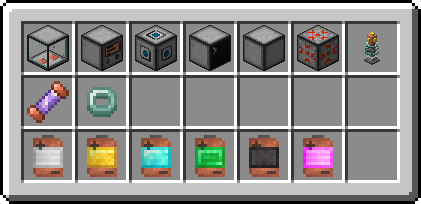
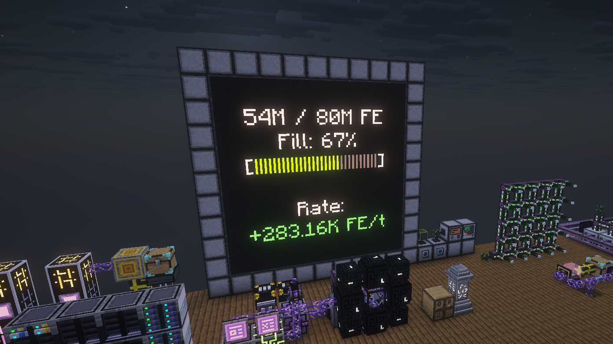

# Iron Batteries
Modular Forge Energy (FE) management. Builds interconnected power grids instead of single-block storage.

### Tiered Storage
Upgrade your battery capacity. Progression tiers: Iron, Gold, Diamond, Emerald, Netherite, Infinite.

### The Network System
* A Controller links utility blocks into a unified power grid.
* Battery Slot: Holds up to 2 batteries to store and share network energy.
* Port: Connects cables/machines. Right-click to cycle modes: Input (pull), Output (push), or Both (bidirectional).
* Monitor: Forms a real-time display when placed in an NxN square.
* Redstone Link: Outputs a 0–15 signal based on energy levels to automate generators.
* Casing: Cheap block to extend network wiring range.

